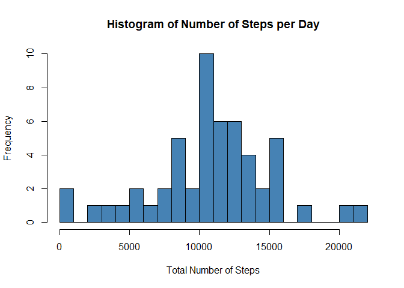
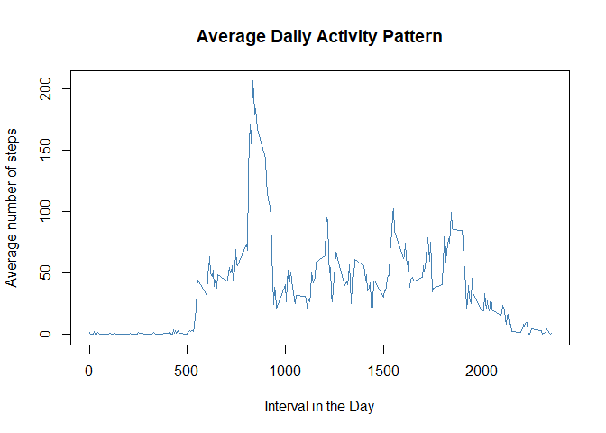
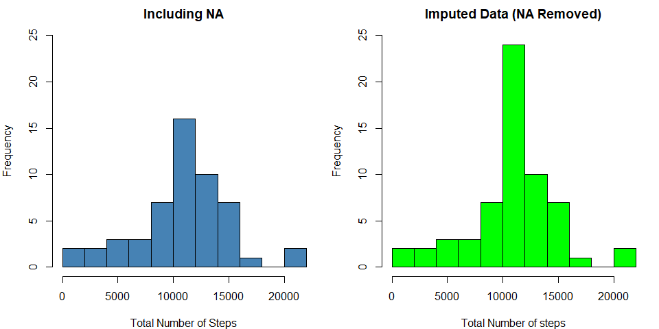
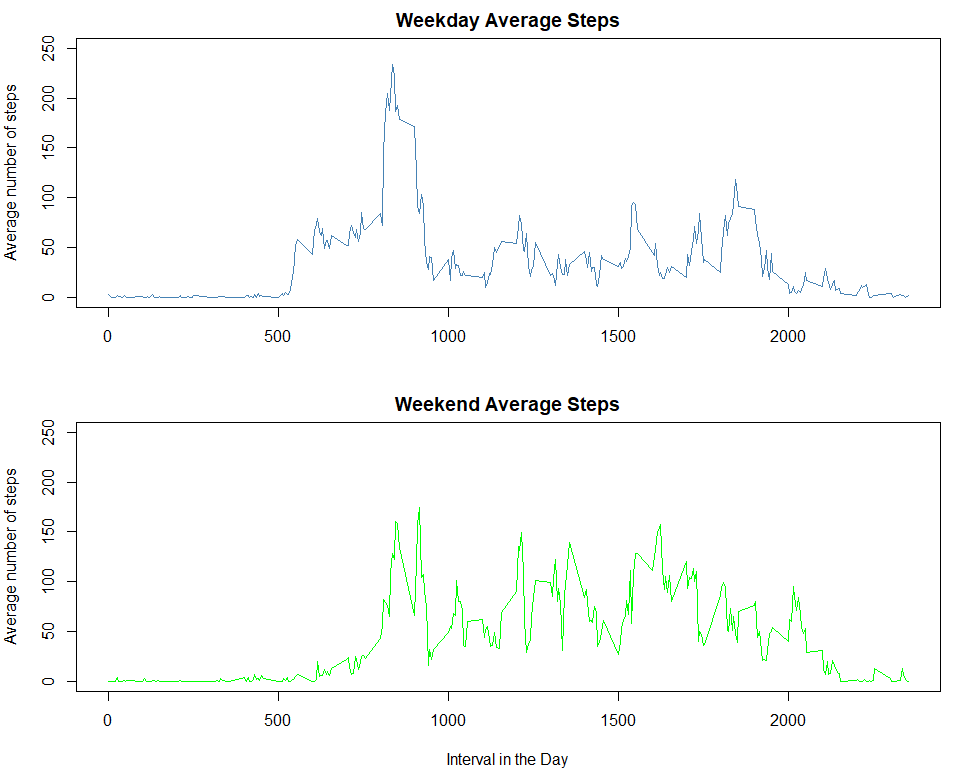

Author: Punya Hirawat


## Loading and preprocessing the data

```r
step_data = read.csv("activity.csv")
step_data$date = as.Date(step_data$date, "%Y-%m-%d")
step_data$day = factor(weekdays(step_data$date),
                       levels = c('Monday', 'Tuesday', 'Wednesday', 'Thursday', 'Friday', 'Saturday', 'Sunday'))
```


## What is mean total number of steps taken per day?

To find per day number of steps:

```r
steps_day = aggregate(steps ~ date, step_data, sum)
head(steps_day)
```

```
##         date steps
## 1 2012-10-02   126
## 2 2012-10-03 11352
## 3 2012-10-04 12116
## 4 2012-10-05 13294
## 5 2012-10-06 15420
## 6 2012-10-07 11015
```
  
Plotting this data:

```r
hist(steps_day$steps, 
     xlab="Total Number of Steps", 
     main = "Histogram of Number of Steps per Day",
     col = 'steel blue',
     breaks = 20)
```

<!-- -->
  

Finding mean and median of this data:

```r
mean =  mean(steps_day$steps)
median = median(steps_day$steps)
```
For total number of steps per day, mean is 1.0766189\times 10^{4} and median is 10765  


## What is the average daily activity pattern?  
First, plotting the average steps taken per time interval:

```r
steps_average = aggregate(step_data$steps, list(step_data$interval), FUN = mean, na.rm=T)
plot(steps_average$Group.1, steps_average$x, 
     xlab="Interval in the Day",
     ylab = "Average number of steps",
     main = "Average Daily Activity Pattern",
     col = 'steel blue',
     type = 'l')
```

<!-- -->

Finding which time interval has the highest average steps:

```r
max = steps_average[which.max(steps_average$x), ]
max_interval = max$Group.1
```
The 835th time interval has most number of steps


## Imputing missing values
We find the total number of missing values by:

```r
all_na = sum(is.na(step_data$steps))
```
Thus, the data set has 2304 NA values  

We replace these missing values with the mean value of the time interval of the missing value

```r
#Function to identify if a value is NA and calculate the mean.
mean_steps <- function(num) replace(num, is.na(num), mean(num, na.rm = TRUE))
#Data Imputed with the above strategy
imputed_data <- step_data %>% group_by(interval) %>% mutate(steps = mean_steps(steps))
```

The new histogram including the imputed data:

```r
new_steps_day = aggregate(steps ~ date, imputed_data, sum)
par(mfrow=c(1,2), mar=c(4,4,2,1))
## Plotting Original Number of steps
hist(steps_day$steps, 
     xlab="Total Number of Steps", 
     main = "Including NA",
     col = 'steel blue',
     breaks = 10,
     ylim = c(0,25))
## Plotting imputed data number of steps
hist(new_steps_day$steps,
     xlab = "Total Number of steps",
     main = "Imputed Data (NA Removed)",
     breaks = 10,
     col = 'green',
     ylim = c(0,25))
```

<!-- -->


The new mean and median are 1.0766189\times 10^{4} and 1.0766189\times 10^{4} respectively.  

Comparing it with that of the original data, there is a difference as the new mean and median are the same


## Are there differences in activity patterns between weekdays and weekends?

First, we have to modify the original Df to denote if the day is a weekday or weekend:

```r
step_data$DayType = ifelse(step_data$day == "Saturday" | step_data$day == "Sunday",
  "Weekend", "Weekday")
```

Once we've done that, we need to divide the data by the daytype

```r
weekday_steps = subset(step_data, step_data$DayType=="Weekday")
weekend_steps = subset(step_data, step_data$DayType=="Weekend")
```

Then using the aggregate function, find the mean per interval:

```r
weekday_steps_average = aggregate(weekday_steps$steps, list(weekday_steps$interval), FUN = mean, na.rm=T)
weekend_steps_average = aggregate(weekend_steps$steps, list(weekend_steps$interval), FUN = mean, na.rm=T)
```

Plotting the two datasets side by side now:

```r
par(mfrow = c(2,1), mar = c(4,4,2,1))
## Weekday Plot
plot(weekday_steps_average$Group.1, weekday_steps_average$x, 
     xlab="",
     ylab = "Average number of steps",
     main = "Weekday Average Steps",
     col = 'steel blue',
     type = 'l',
     ylim = c(0,250))
## Weekend Plot
plot(weekend_steps_average$Group.1, weekend_steps_average$x, 
     xlab="Interval in the Day",
     ylab = "Average number of steps",
     main = "Weekend Average Steps",
     col = 'green',
     type = 'l',
     ylim = c(0,250))
```

<!-- -->

Observations:  
- There is a noticeable difference as to when the person starts moving comparing weekdays to weekend  
- The peak movement occurs in the weekdays, while there is lesser standard deviation during he weekends  
- The mean number of steps on both weekdays and weekends are almost the same
